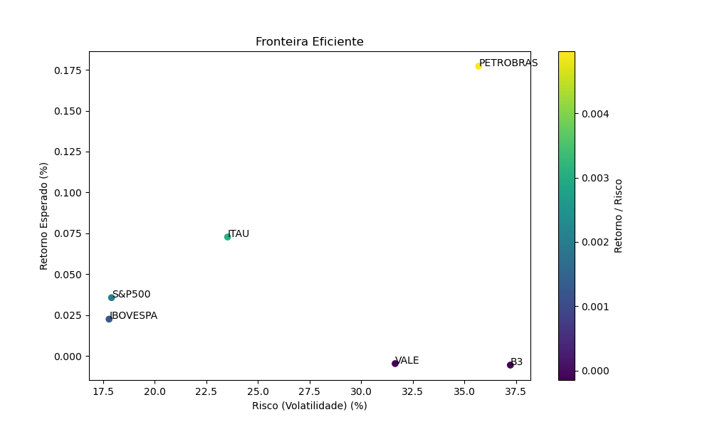
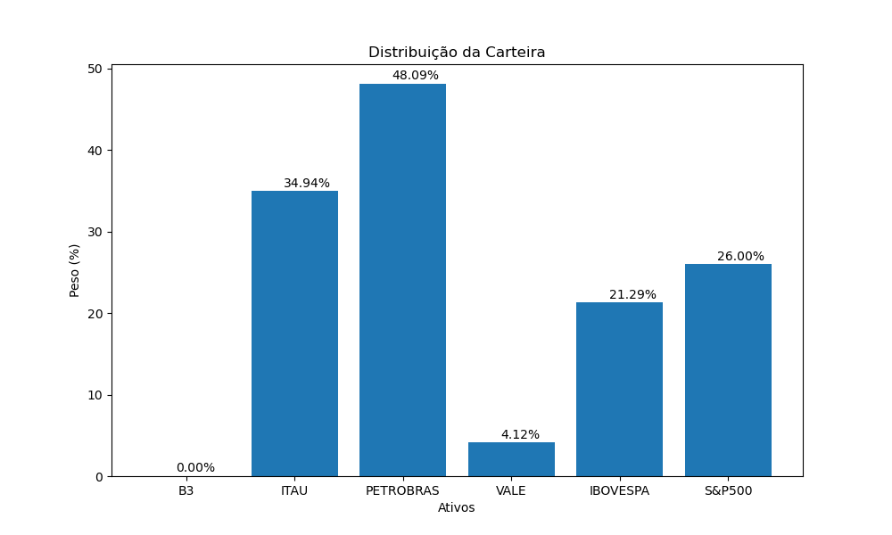
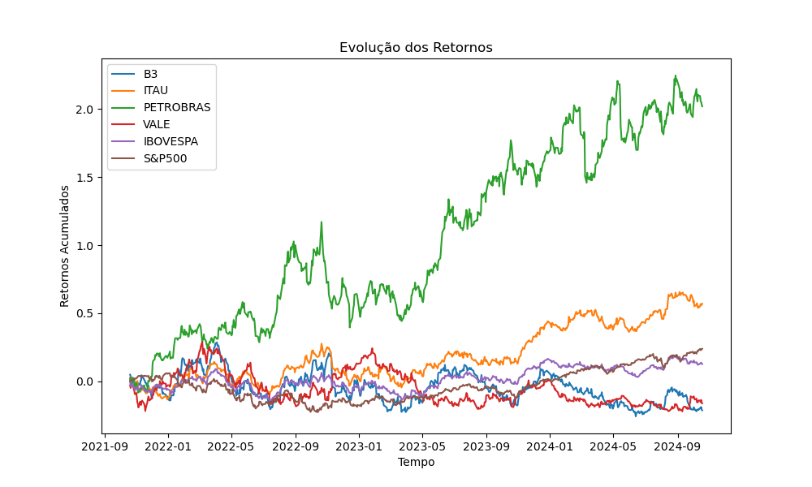
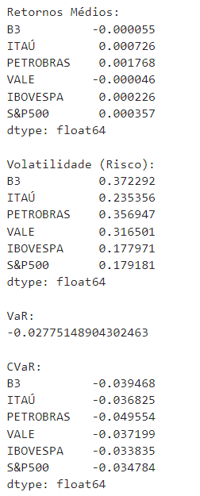

# Otimização de Carteira de Investimentos

Este projeto realiza a otimização de portfólio de investimentos utilizando dados históricos de ações e índices de mercado. Ele calcula retornos esperados, risco (volatilidade) e as métricas de Value at Risk (VaR) e Conditional Value at Risk (CVaR). Além disso, gera gráficos para visualizar a fronteira eficiente e a alocação de pesos dos ativos.

## Funcionalidades

- Download de dados históricos de ações e índices de mercado usando a biblioteca `yfinance`.
- Cálculo de retornos logarítmicos.
- Cálculo de volatilidade (risco) do portfólio.
- Cálculo de VaR e CVaR para análise de risco.
- Otimização da alocação de ativos com base em retornos esperados e riscos.
- Geração de gráficos para visualizar resultados.

## Pré-requisitos

Antes de executar o código, é necessário ter instalado o Python (versão 3.6 ou superior).

## Instalação

Os pacotes necessários para este projeto serão instalados automaticamente através do script `install_packages.py`. Certifique-se de que este arquivo está presente no diretório do projeto.

## Uso

1. Clone este repositório ou faça o download do arquivo Python.

2. Abra o arquivo Python em seu ambiente de desenvolvimento ou editor de código.

3. Execute o código. Os resultados incluirão:
   - Retornos médios dos ativos.
   - Volatilidade (risco).
   - VaR e CVaR.
   - Gráficos da fronteira eficiente e da distribuição de pesos do portfólio.

### Exemplo de Execução

```bash
python investment_optimization.py
```

## Funções Principais

### 1. `calcular_var(dados, nivel=0.05)`
Calcula o Value at Risk (VaR) a um determinado nível de confiança.

- **Parâmetros:**
  - `dados`: Array de dados financeiros.
  - `nivel`: Nível de confiança para o cálculo (default é 0.05 para 95%).

- **Retorno:** O VaR calculado.

### 2. `calcular_cvar(dados, nivel=0.05)`
Calcula o Conditional Value at Risk (CVaR) a um determinado nível de confiança.

- **Parâmetros:**
  - `dados`: Array de dados financeiros.
  - `nivel`: Nível de confiança para o cálculo (default é 0.05 para 95%).

- **Retorno:** O CVaR calculado.

### 3. `otimizar_carteira(retornos, riscos, capacidade)`
Otimizador de carteira que utiliza programação linear para maximizar os retornos sob uma restrição de risco.

- **Parâmetros:**
  - `retornos`: Retornos esperados dos ativos.
  - `riscos`: Volatilidade dos ativos.
  - `capacidade`: Limite de risco aceito.

- **Retorno:** Pesos ótimos dos ativos na carteira.

## Visualizações e Gráficos

### Fronteira Eficiente
Um gráfico que mostra a relação entre risco e retorno esperado dos ativos. Os pontos são coloridos de acordo com a razão retorno/risco.


### Distribuição da Carteira
Um gráfico de barras que representa a alocação percentual de cada ativo na carteira otimizada.


### Evolução dos Retornos
Um gráfico que mostra os retornos acumulados ao longo do tempo para cada ativo.


### Última Execução
Uma captura da última execução do script.

